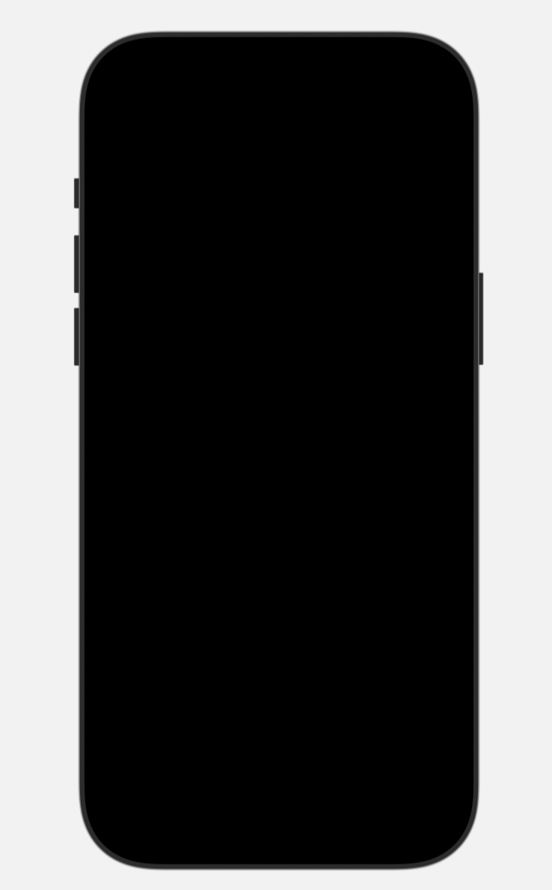
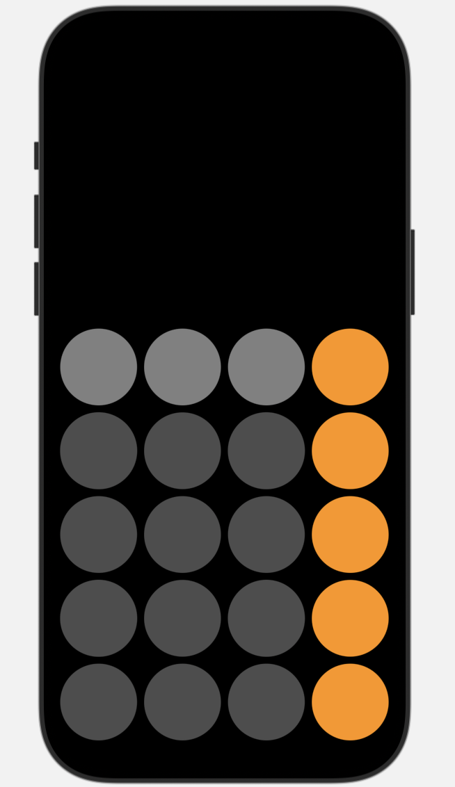
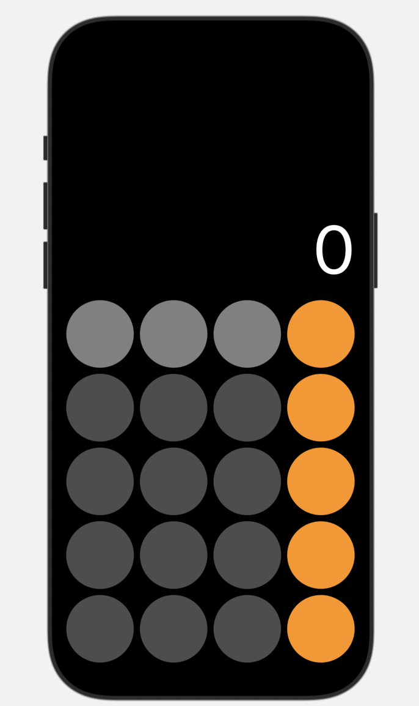
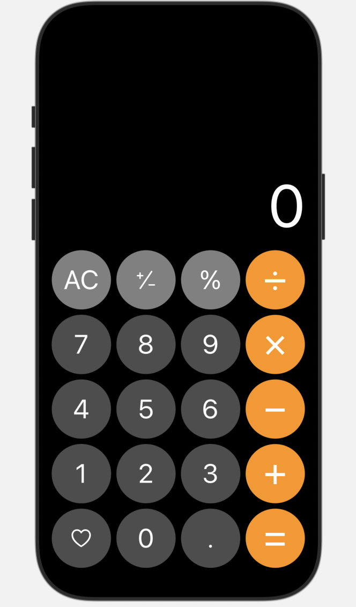

//
//  README.md
//  1st_hw_parkyeongeon
//
//  Created by Taemin KIM on 9/19/25.
//

# iPhone 계산기 화면 그리기

아래는 단계별 진행 상황과 결과 이미지입니다.

---

## [1단계] 검은 배경 씌우기

- 전체 화면에 검은 배경 적용 완료
- ZStack 사용하면 검은 배경 위에 요소들을 올릴 수 있음

---

## 2단계: 5행 4열 Circles 그리기

- 5행 4열의 Circles 그리기 (20개)
- VStack, HStack 필요
- bottom 정렬
- Color 적용
- Size는 frame에 맞게 자동 조절됨.(frame: padding horizontal 10)

---

## 3단계: Result 위치에 0 띄우기

- 계산기 결과 영역에 숫자 0 출력
- 폰트 크기, color 지정
- 위치 조절 완료

---

## 4단계: Circles 내부에 Text 및 Icon 삽입

- Circles 버튼 내부에 텍스트 또는 아이콘 삽입
- 아이콘은 SF Symbols 앱에서 찾을 수 있음
- 버튼별 색상 및 크기 조절 완료

---

## 완성!
