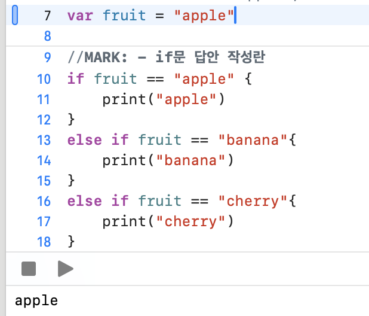
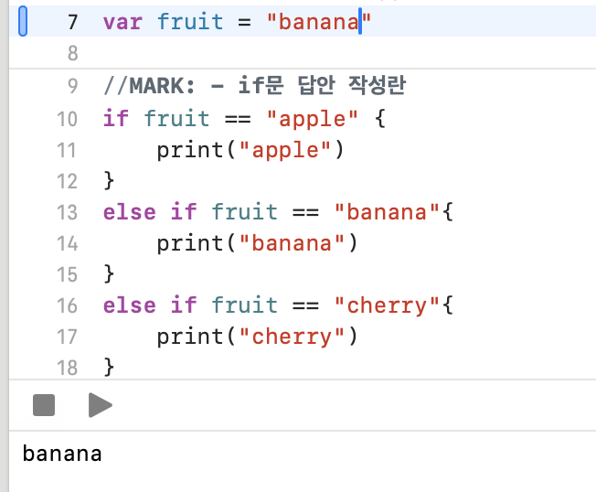
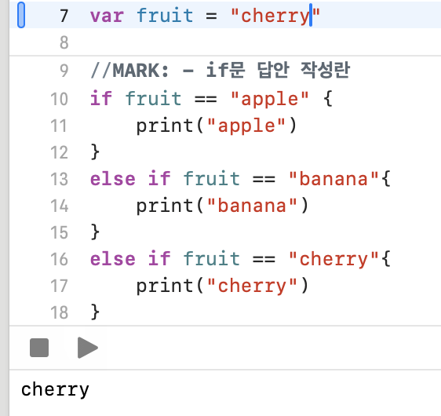
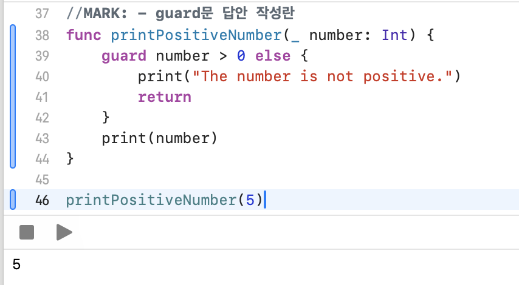
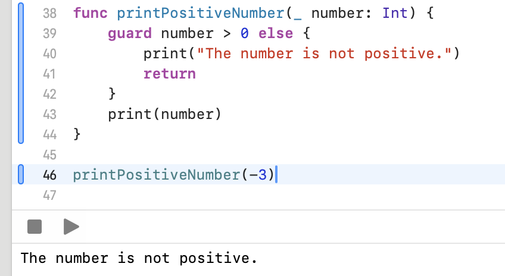
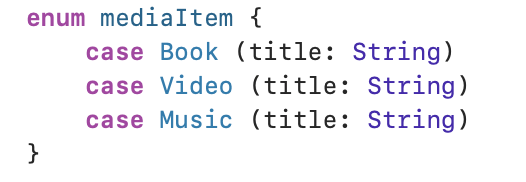
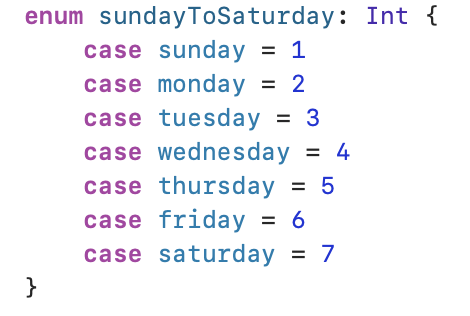
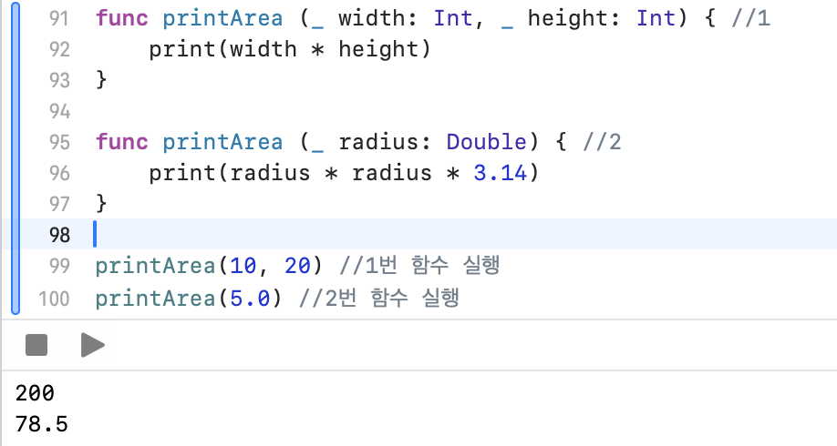

# 문법 실습하기

아래는 각 문제의 결과 이미지입니다.

---

## [문제1] if문
### 문자열 변수 fruit이 "apple", "banana", "cherry" 중 하나일 때, 해당하는 과일을 출력하세요.

- fruit이 apple일 때

- fruit이 banana 때

- fruit이 cherry 때

---

## [문제2] guard문
### 함수 printPositiveNumber를 작성하세요. 이 함수는 하나의 정수 인자를 받아, 그 값이 양수일 경우에만 그 값을 출력합니다. 만약 값이 양수가 아니라면, "The number is not positive."를 출력합니다.

- number가 5일 때

- number가 -3일 때

---

# [문제3] enum 연관값
### "책(Book)", "비디오(Video)", "음악(Music)" 등의 미디어 아이템을 나타내는 열거형을 작성하세요. 각 아이템에는 타이틀(title)이라는 연관값을 부여합니다.

---

# [문제4] enum 원시값
### 열거형을 사용해 주중(sunday to saturday)을 나타내세요. 각 요일에는 1부터 7까지의 원시값을 부여합니다.

---

# [문제4] 함수 오버로딩 (Overloading)
### printArea라는 함수를 작성해보세요. 이 함수는 사각형의 가로와 세로 길이를 받아 면적을 출력하고, 또 다른 버전의 함수는 원의 반지름을 받아 면적을 출력합니다.

