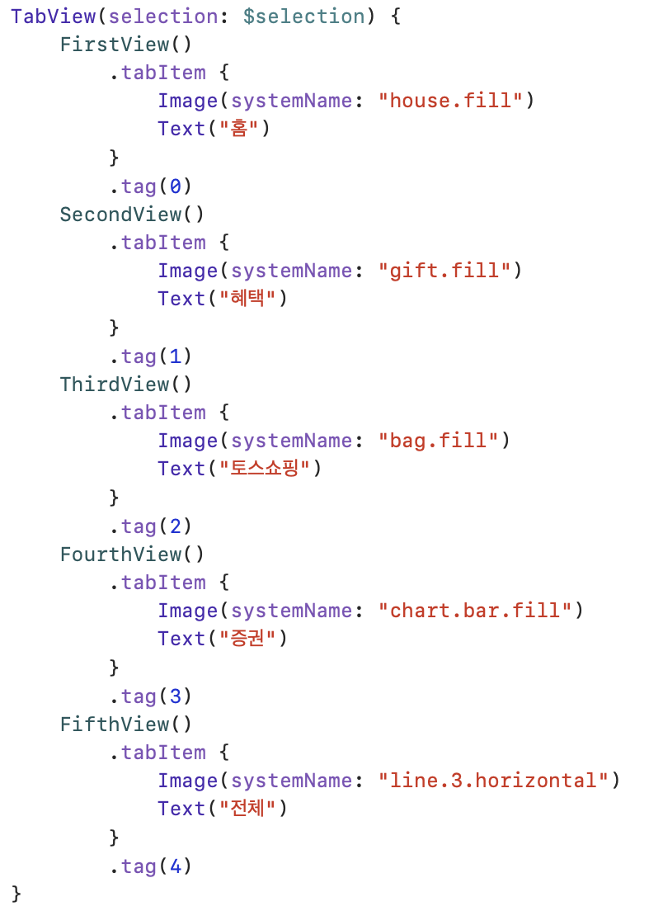
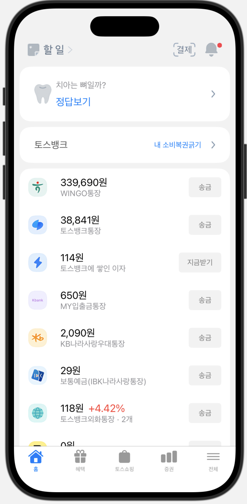
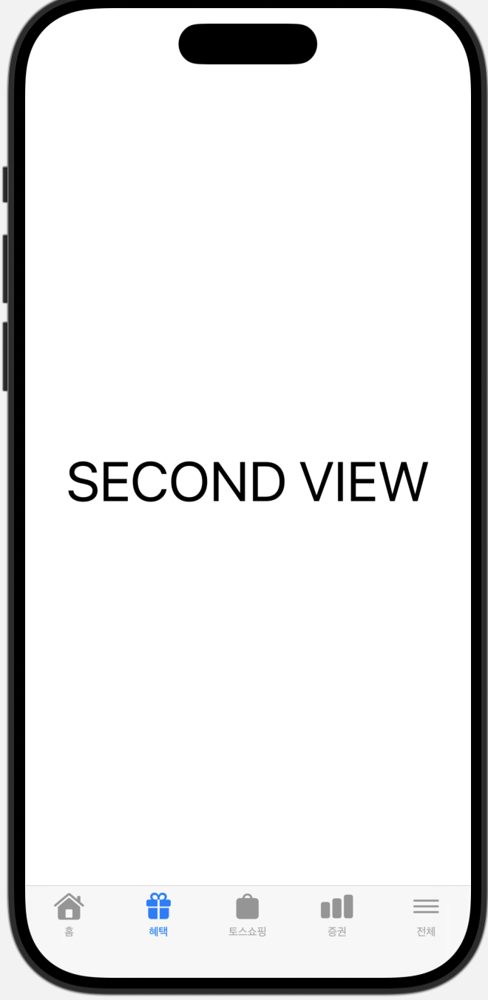
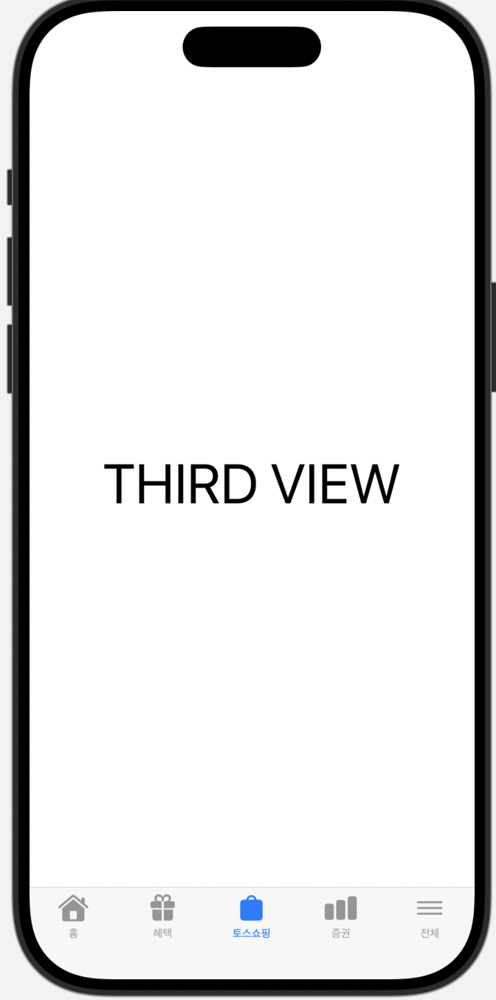
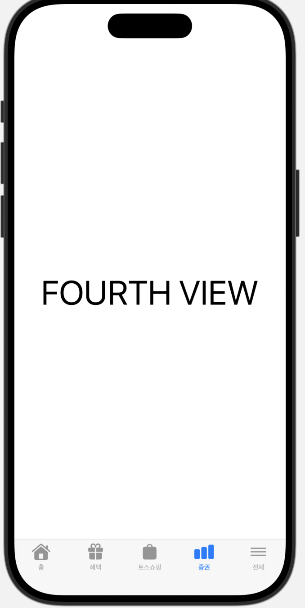
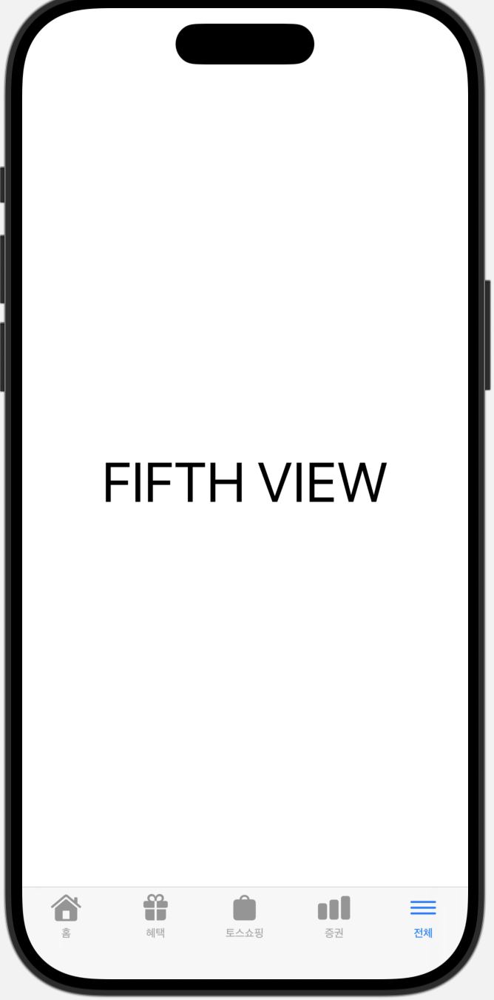
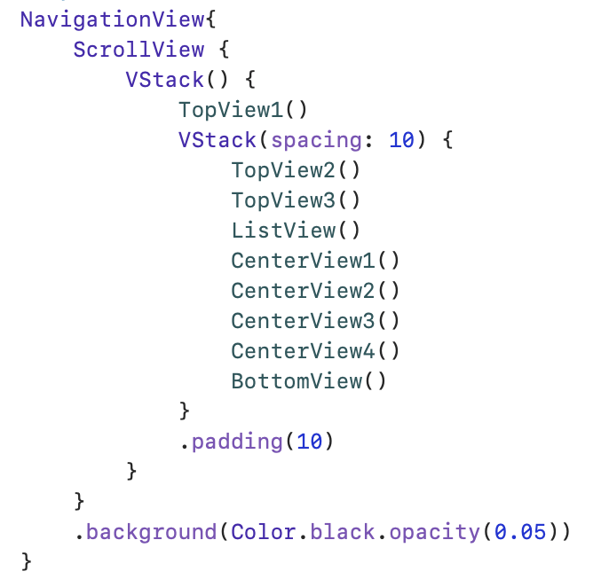
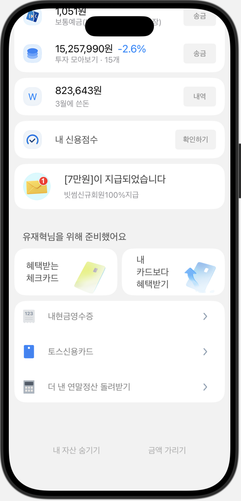
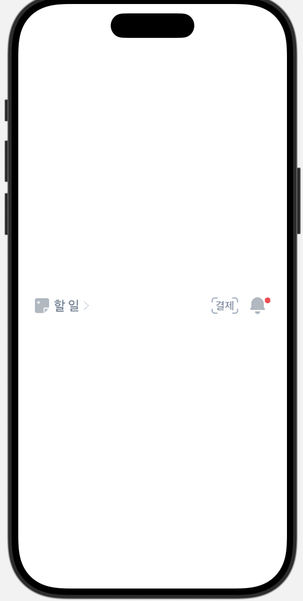
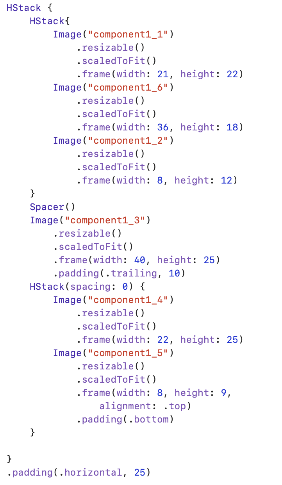

# 토스뱅크 앱 구현하기

아래는 뷰 구성과 출력 이미지를 정리한 것입니다.

---

## [1] MyTabView
#### MyTabView는 1st ~ 5th View를 담는 최상위 뷰입니다.

### CODE

### RESULT
- FirstView

- SecondView ~ FifthView

  
  
  
  

---

## [2] FirstView
#### FirstView는 NavigationView를 사용: 링크 이동이 가능한 페이지입니다.
#### ScrollView를 사용: 아래로 스크롤이 가능합니다.

### CODE

- TopView1() ~ TopView3()
- ListView()
- CenterView1() ~ CenterView4()
- BottomView()로 구성된 뷰

### RESULT
- Full page

    
    

- TopView1

    
    

