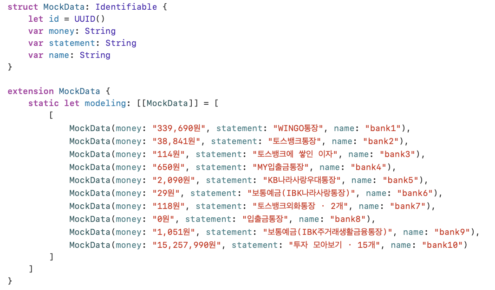

# 토스뱅크 앱 구현하기

아래는 뷰 구성과 출력 이미지를 정리한 것입니다.

---

## [1] MyTabView
#### MyTabView는 1st ~ 5th View를 담는 최상위 뷰입니다.

### CODE

### RESULT
- FirstView

- SecondView ~ FifthView

  
  
  
  

---

## [2] FirstView
#### FirstView는 NavigationView를 사용: 링크 이동이 가능한 페이지입니다.
#### ScrollView를 사용: 아래로 스크롤이 가능합니다.

### CODE

- TopView1() ~ TopView3()
- ListView()
- CenterView1() ~ CenterView4()
- BottomView()로 구성된 뷰

### RESULT
- Full page

    
    

- TopView1

    
    

- TopView2

    
    

- TopView3

    
    

- CenterView1

    
    

- CenterView2

    
    

- CenterView3

    
    

- CenterView4

    
    

- BottomView

    
    
    

---

## [3] LinkView

#### LinkView는 데이터모델의 데이터 수만큼 ListCell을 반복 출력한 뷰 입니다.
#### 리스트를 사용하지 않았지만, 리스트처럼 보임

### CODE

- 데이터 모델

- ListCell

    
    

    
    

### RESULT

# [4] NextView

#### NextView는 ListCell의 송금 버튼을 누르면 넘어가는 다음 페이지입니다. (FirstView의 destination)
#### 페이지가 넘어갈 땐 data.money 값도 함께 반영됩니다.
#### NextTopView()와 NextListView()로 구성된 뷰입니다. 

### CODE

### RESULT
- NextView

    
    

- NextTopView

    
    

- NextListView

    
    

