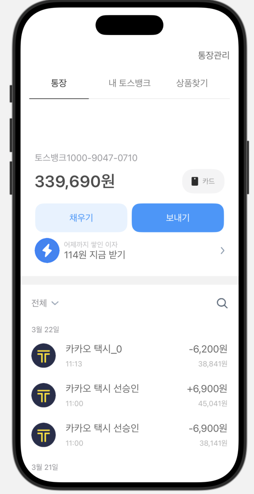

# 토스뱅크 송금 앱 클론

---

## 지난 과제에서 수정한 점

✅ **1. 파일 구조 및 네이밍 개선**  
- 파일명을 보기 쉽게 정리 (`TabView1_home.swift`, `TopView_todo.swift`, `KeyPad.swift` 등)  
- 관련된 뷰끼리 **폴더 구조화 (Home / Remittance / Send 등)** 

### Before

    

### After

    

✅ **2. 화면 전환 구조 개선**  
- `NavigationLink` → `fullScreenCover` 로 변경하여  
  다음 화면으로 넘어갈 때 **탭바가 사라지도록 수정**

### Before

    
    

### After

    
    

✅ **3. ‘보내기’ 버튼 기능 추가**  
- 단순 디자인 버튼에서 실제 **송금 플로우가 작동하는 버튼으로 개선**  
- 입력된 금액(`InputModel`)과 선택된 계좌(`AccountData`)를 함께 전달  
- 버튼 클릭 시 **다음 단계(송금 확인 화면)** 으로 전환되도록 구현  

---

## 실행 화면 미리보기

#### [1] 첫 화면

#### [2] 송금 버튼 클릭

#### [3] 보내기 버튼 클릭

#### [4] WINGO통장 클릭

#### [5] 금액 입력
- 적정 금액 입력

- 초과 금액 입력

#### [4] 다음 클릭 -> 최종 확인 메시지
