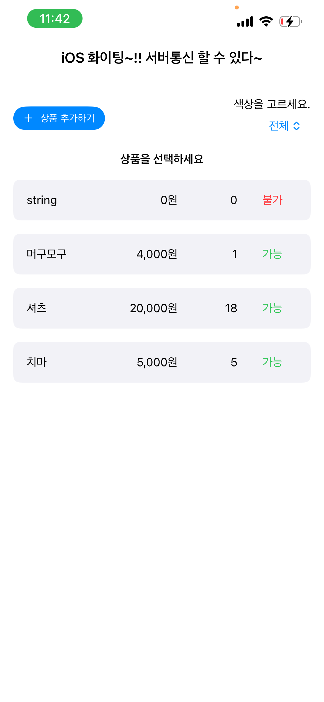
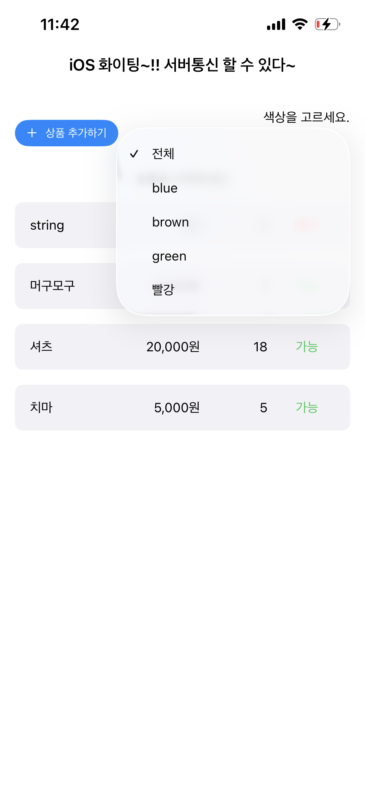
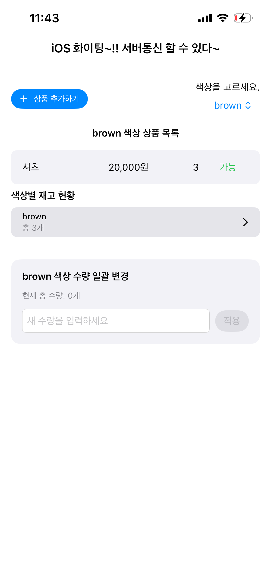
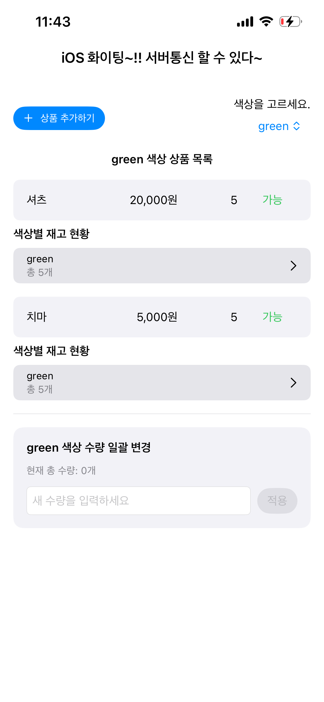
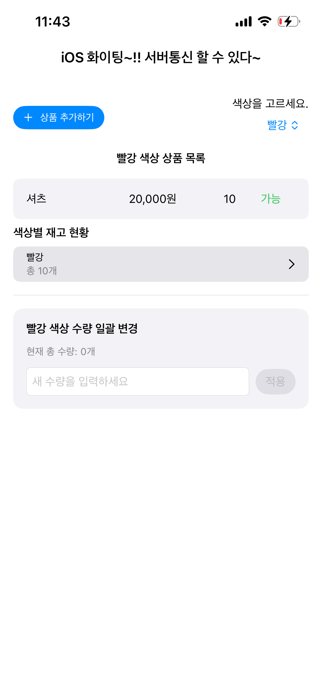
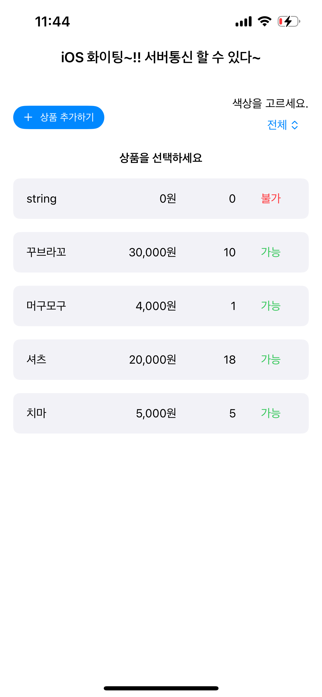
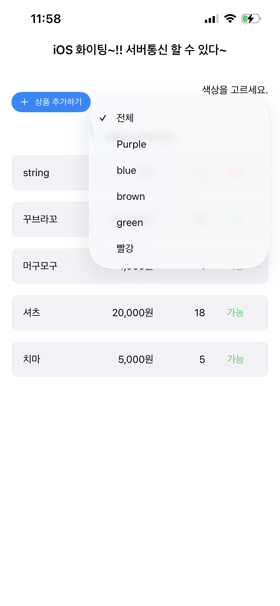

# iOS 상품 관리 앱

---

# 📸 스크린샷

아래는 앱의 주요 화면 흐름입니다.

## 1️⃣ 메인 화면

전체 상품 리스트 + 색상 선택 메뉴가 있는 기본 홈 화면입니다.

---

## 2️⃣ 색상 선택 메뉴 (Color Picker)

서버에서 받아온 색상 목록을 자동으로 표시합니다.

---

## 3️⃣ BLUE 색상 선택

BLUE 색상만 필터링된 상품 리스트 + 색상 재고 현황.

---

## 4️⃣ BROWN 색상 선택

서버에 존재하는 BROWN 색상의 상품만 화면에 표시됩니다.

---

## 5️⃣ GREEN 색상 선택

GREEN 색상의 상품이 있는 경우 이렇게 표시됩니다.

---

## 6️⃣ RED 색상 선택

RED 색상의 재고와 상품 목록.

---

## 7️⃣ 새로운 상품 추가 (예: 꾸브라꼬)

상품명, 가격, 색상, 수량을 입력하여 서버에 새로운 상품을 POST 합니다.

---

## 8️⃣ 새로운 컬러 상품 추가 후 색상 리스트 자동 업데이트

새로운 색상의 상품을 등록하면 색상 선택 메뉴에도 자동 반영됩니다.

